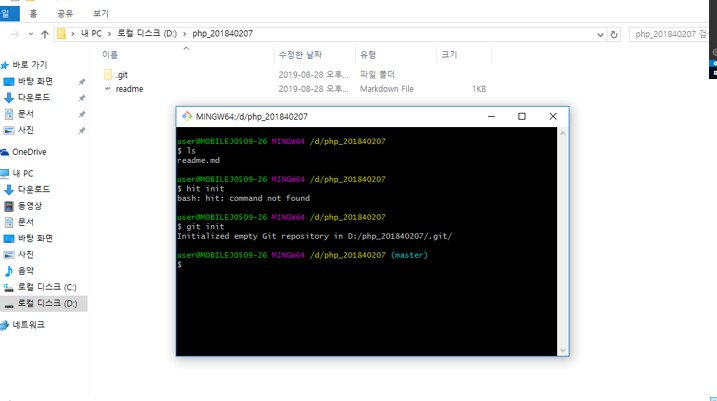

# 수업 2019.08.28
## 수업내용 정리

D드라이브 안에 php폴더 생성 후 그 안에 hello.html생성

제목태그 h1~h6까지 있음

본문태그 p

php.net에 들어가서 php-7.2.21.zip파일 다운

C드라이브에 파일 압축 푼 다음 이름을 php로 바꾼 후 cmd에서 확인

고급 시스템 설정에서 path 환경변수에 C:\php 추가

cmd 창에서 잘됐는지 확인

hello.php 파일 생성 후 cmd창에서 실행

<%php ~ %> 밖에 있는 내용도 출력됨

cmd에서 php -S localhost:8000 입력해서 서버 실행

주소창에 'http://localhost:8000/hello.php’ 입력하면 hello.php가 나옴

php파일에 html 태그 사용 가능 echo말고 print를 써도 화면에 출력됨 
<%php ~ %>밖의 내용도 출력됨

$hello라는 변수를 만들어 값을 넣어준 다음 echo $hello를 입력하며 화면에 출력됨  
var_dump는 변수의 길이를 출력한 다음 내용 출력됨

실행화면들

파이썬 주석은 #

$name이 abc이므로 $abc가 되어서 대림이가 두번 출력됨

typora 사용화면

git다운받은 후 D드라이브에 php_201840207파일 생성, 생성한 파일에 커서를 놓은 후 오른쪽 클릭하여 git bash 실행, git init 입력하면 .git이라는 파일 생성됨

아까 typora로 작성했던 readme.md를 php_201840207에 저장

git add readme.md를 입력해서 readme.md를 git에 저장하고 git hub에 옮길 때 쓸 유저이름과 이메일 씀

git push -u origin master 입력 후 github 로그인

git remote add origin https://github.com/kimminha371/php_201840207.git 입력

github에 php_201840207 프로젝트 생성 후 readme.md 저장