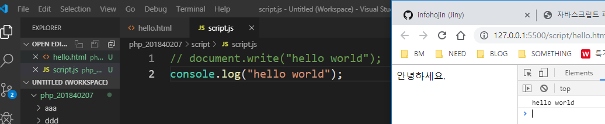
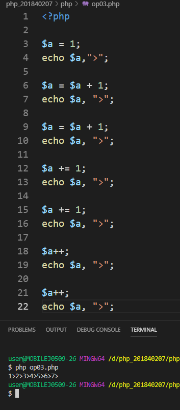
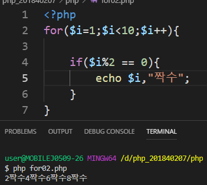
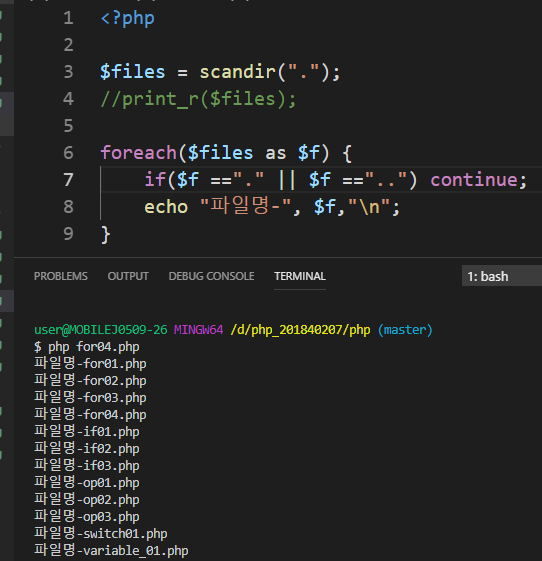

# 수업 2019.09.11
## 수업내용 정리

 
Live server 다운로드 
 
Script 폴더 만들고 그 안에 hello.html 생성 후 탐색기에서 hello.html 실행 
 
위와 같이 하기 귀찮으면 마우스 오른쪽 클릭 후 open with live server 누르면 실행됨 
 
자바스크립트가 body 요소의 일부를 제어를 하려고 할 때 아직 브라우저가 해석이 되지 않은 상태에서 먼저 자바스크립트 코드가 실행이 될 수도 있기 때문에 자바스크립트 코드를 바디의 종료태그 앞에 작성하는 경우가 많다. 
 
Script.js파일을 따로 만들어서 hello.html에 src 코드를 써서 연결해주면 안녕하세요. 가 나온다. 
 
(F12-개발자 도구 실행) console.log를 쓰면 크롬 콘솔창에서 실행되는 것을 볼 수 있다. 
 
Console.log(“안녕하세요.”) 실행화면 - 콘솔모드에서도 바로 실행이 가능하다. 
 
콘솔모드에 document.write를 쓰면 화면에도 출력된다. 
 
Alert를 쓰면 메시지 창이 뜬다. 
자바스크립트 파일명에 .min이라는 단어가 포함되어 있는 것이 있는데 이 파일에서는 명령을 해석하는 과정에서 공백은 제외된다. 소스코드에서 명령 사이에 있는 공백을 제거하여 크기를 줄인 파일을 말한다. 
 
Node.js 다운 
 
설치 다 하면 path환경변수에 있는지 확인 
 
git bash에서 실행한 화면 
 
gitbash에서 실행 화면 
자바스크립트는 변수 선언할 때 $를 붙이지 않아도 됨 붙여도 상관없음 
 
Settings – features – terminal – edit in settings.json을 열어서 위와 같이 작성하면 바로 터미널에서 gitbash 사용가능하다. 
 
터미널에서 실행한 화면 
 
Js 파일과 php 파일 실행 화면 
Js, php변수명은 숫자로 시작할 수 없음 (_은 처음에 사용가능) 
 
변수명 대소문자 구분 
 
소수 사용가능 
 
0을 붙이면 문자에서 첫번째 문자가 나옴 
 
\n을 쓰면 다음 줄에 출력됨 
 
변수명앞에 아무것도 안써도 상관없지만 var, let 써주는게 좋다. 
 
변수는 다른 변수의 값을 이용하여 입력을 할 수 있다. 
값이 복사되어 저장이 됨 이후 원본 변수의 값을 변경하더라도 복사된 값은 변함이 없음 
 
Js는 typeof php는 var_dump를 쓰면 문자열인지 숫자형인지 알 수 있음 
상수 선언할 때 이름을 대문자로 하고 php에서는 const, define() js에서는 const를 사용한다. 
 
 
Git commit – esc + I – 파일명 – esc+:wq 
 
 
a값을 바꾸면 b값도 바뀜 
 
intval - int형으로(정수로) 출력 
 
1씩 더하는 3가지 방법 
 
a—는 일단 a에 5를 대입한 후 -1하기 때문에 5가 나온다. 
 
if(조건) – 조건이 참이면 {}안에 있는거 실행 거짓이면 else 실행 
 
if에 있는 조건에 맞지않고 else if()조건에 맞으면 실행 
 
&&은 조건이 다 맞아야 실행한다. ||은 조건중에 하나만 맞으면 된다. 
 
n이 2이면 둘 실행, 1이면 하나 실행 break가 실행되면 switch문 밖으로 나감 
 
3항 연산자 조건이 참이면 앞에꺼 실행 
 
 
 
3개 다 같은 결과 
 
$i가 2면 아니야 실행하고 빠져나옴 
 
$i를 2로 나눴을 때 나머지가 0이면 짝수 실행 
 
continue를 쓰면 그 문은 실행하지 않고 바로 else로 넘어감 
 
 
디렉토리 출력 
 
.과 ..제외한 파일들 출력 
 
foreach 사용 
 
무한루프 
 
 
같은 결과 
 
for01.php의 코드가 그대로 출력됨 
 
 
$를 읽어올때마다 count가 1씩 늘어나서 코드에 $표시가 몇 개 있는지 출력 