# 2019.09.18
## 수업내용 정리

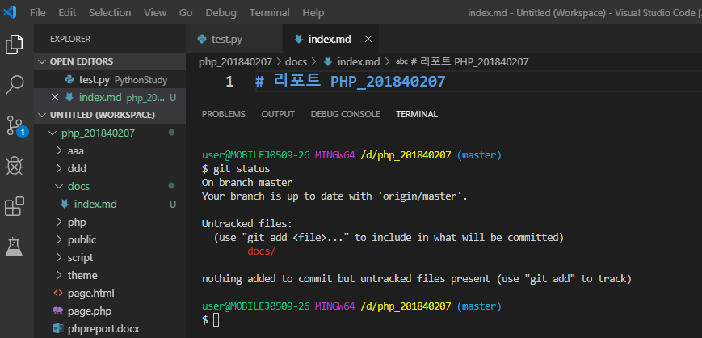 
docs-index.md 
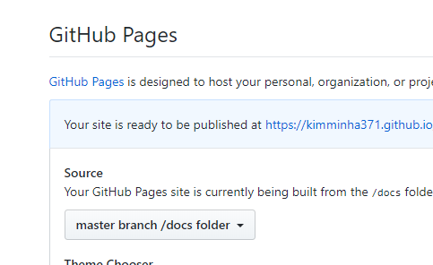 
docs 폴더를 git에 넣은 후 github에 settings에 들어가서 설정을 바꿈 
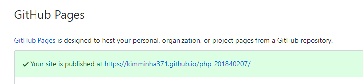 
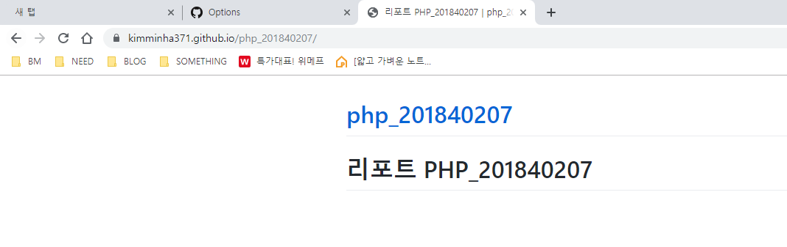 
저 주소로 들어가면 화면에 저렇게 나옴 
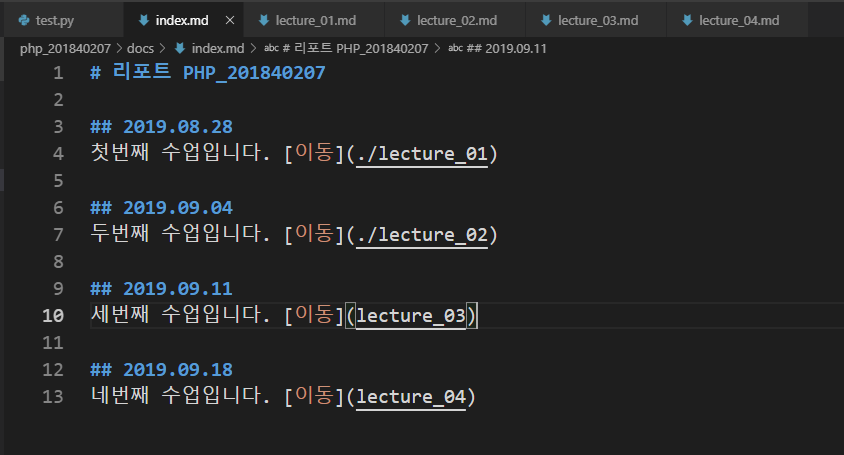 
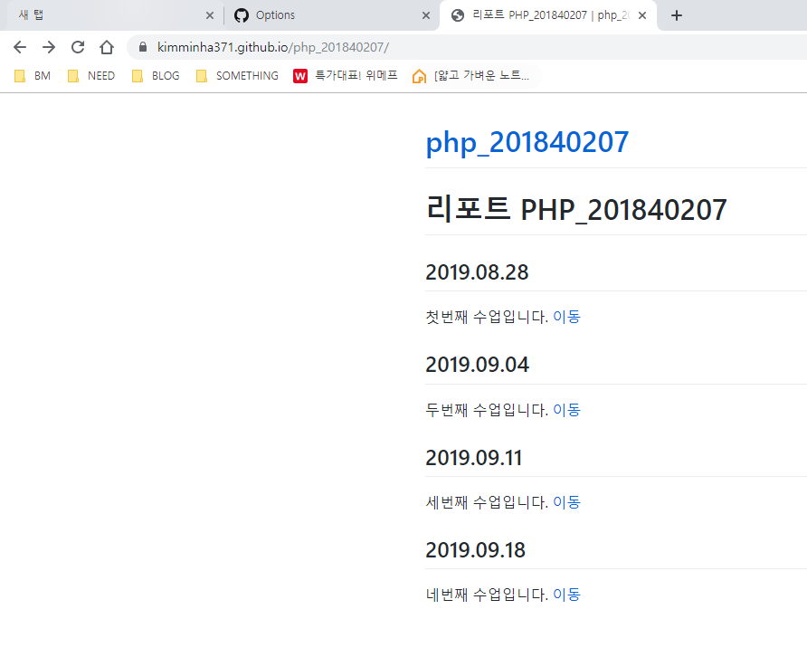 
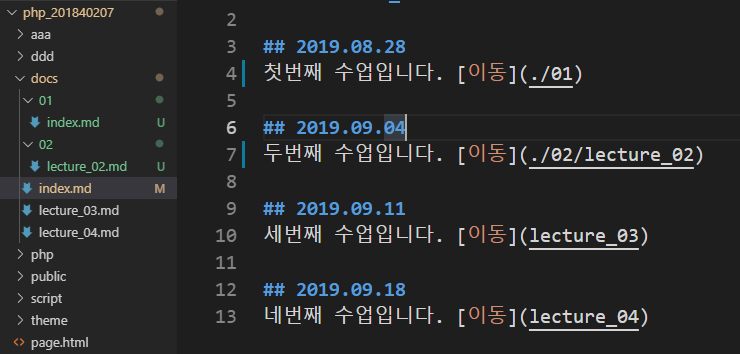 
01폴더 안에 lecture_01을 넣고 index.md로 이름을 바꾸고 02폴더 안에 lecture_02을 넣은 후 이동경로를 저렇게 지정한다. 
01폴더 안에는 index가 있기 때문에 파일명을 쓰지않아도 되지만 02폴더에는 index파일이 없기 때문에 파일명을 써줌 
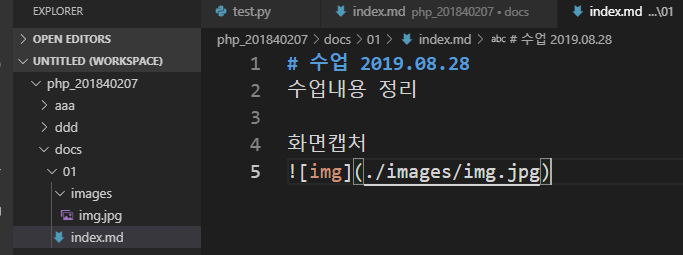 
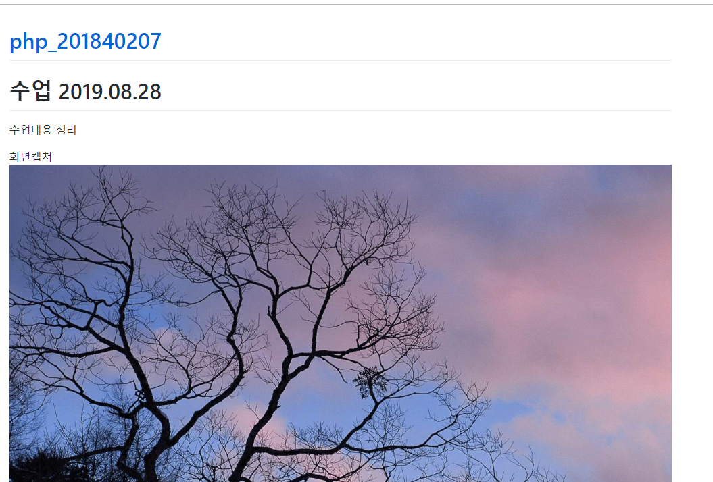 
01폴더 안에 images폴더를 만든 후 그 안에 img.jpg라는 이미지를 추가하고 코드를 작성함 
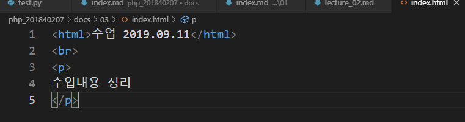 
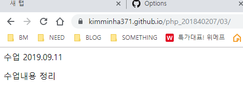 
03폴더 안에 lecture_03을 넣고 index로 이름을 바꾼 후 경로를 ./03으로 바꿔줌 
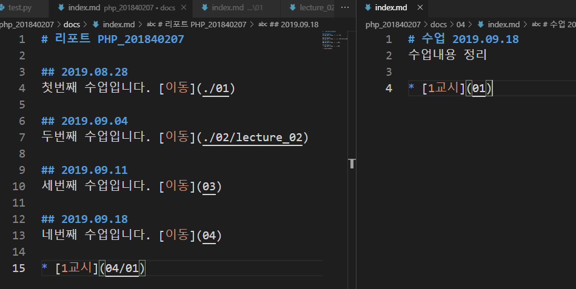 
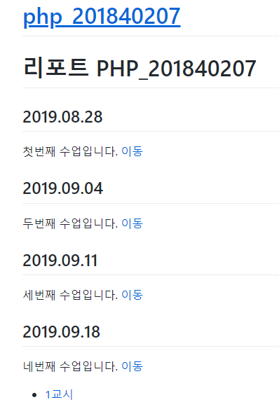 
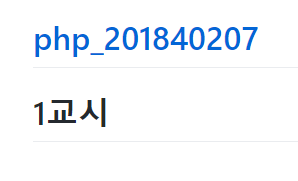 
04폴더 안에 lecture_04를 넣고 이름을 index로 바꾼 후 01파일을 만들어 그 안에 # 1교시라고 작성 
‘*’은 html의 li태그와 같은 것, 화면은 저렇게 나온다. 
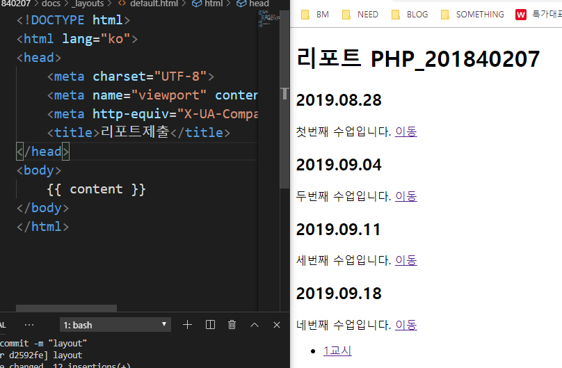 
Docs 폴더 안에 layouts라는 폴더를 만들고 그 안에 default.html파일을 만듦 
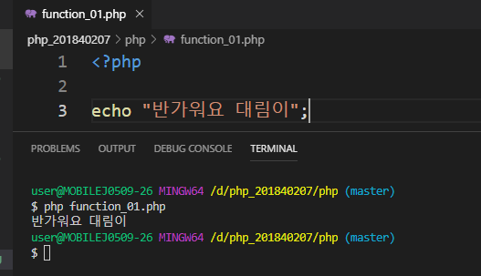 
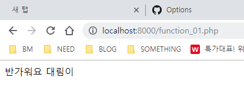 
Gitbash에 php –S localhost:8000해서 서버를 열어서 크롬에서 실행 
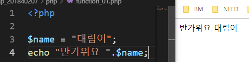 
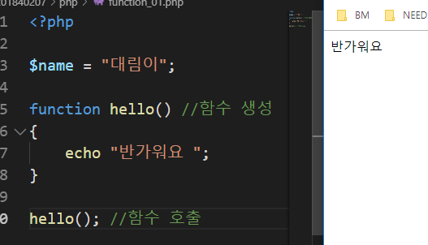 함수 사용 
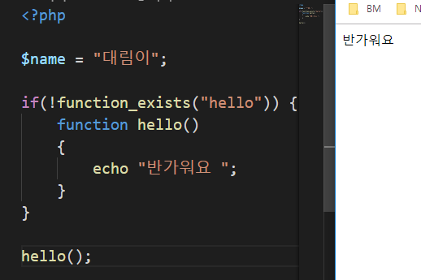 
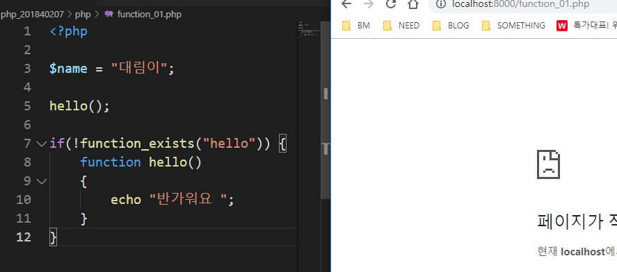 
If문 위에 함수를 호출하면 오류 뜸, 그냥 함수 위에 함수를 호출하면 오류 뜨지 않음 
if문은 두 번 써도 오류 뜨지 않음, 같은 이름의 함수를 두 번 쓰면 오류 뜸 
호출은 중복가능 
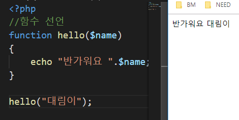 
 
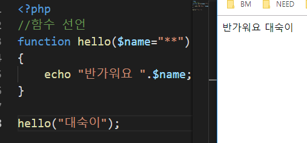 
값을 넣어주면 그 값이 나오고 안넣어주면 초기값이 나옴 
 
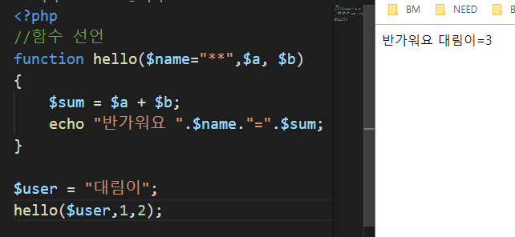 
값 여러 개 넣을 수 있음 
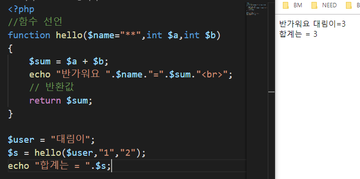 
리턴값은 무조건 하나만 가능 
 
가변함수 
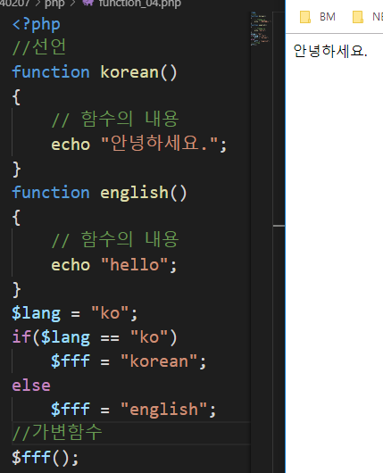 
가변함수를 선택적으로 쓸 수 있음 
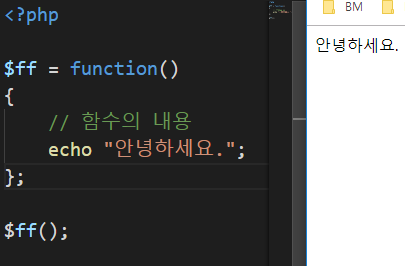 
익명함수 
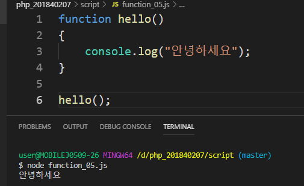 
자바스크립트로 똑같이 한 것 
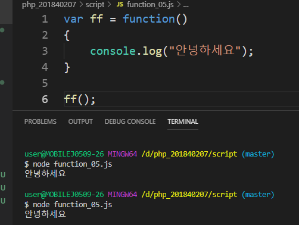 
자바스크립트도 익명함수 됨 
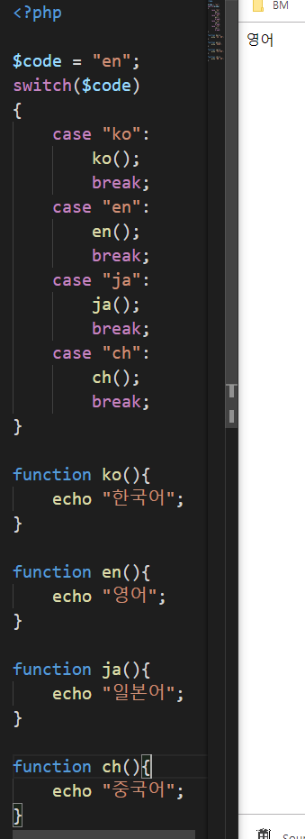 
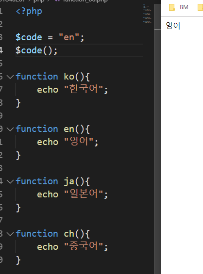 
둘다 같은 기능, 오른쪽은 익명함수 활용 
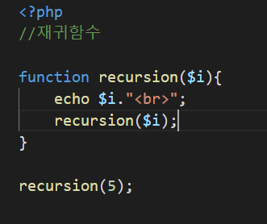 재귀함수 무한루프 
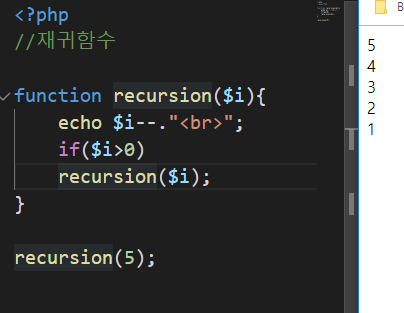 재귀함수를 사용해 5~1까지 출력 