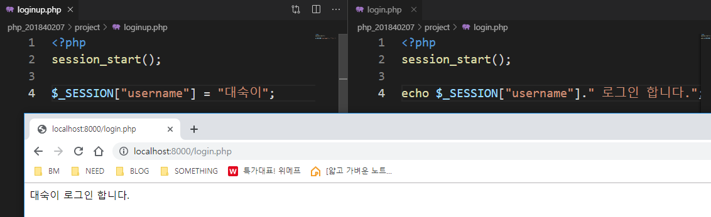
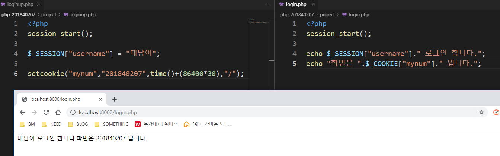
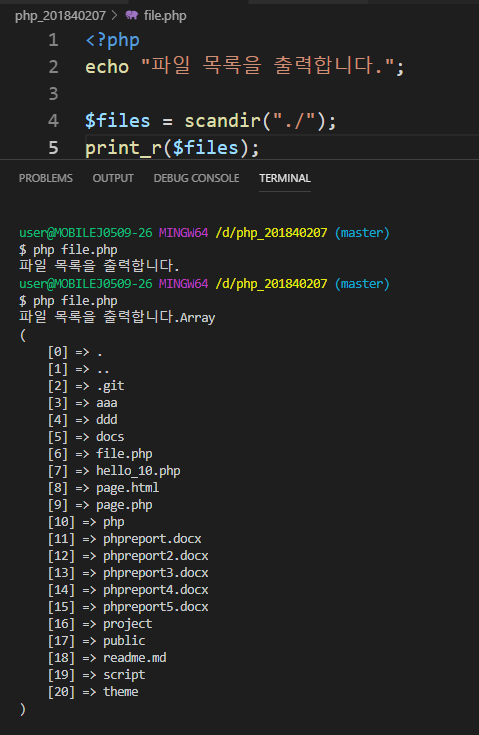
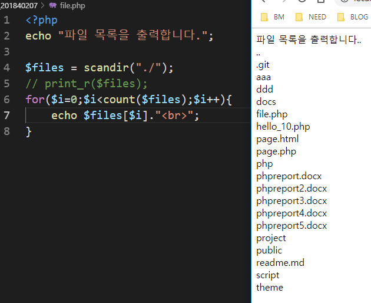
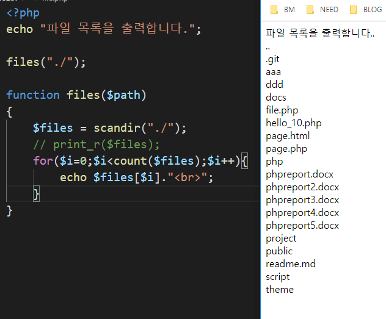
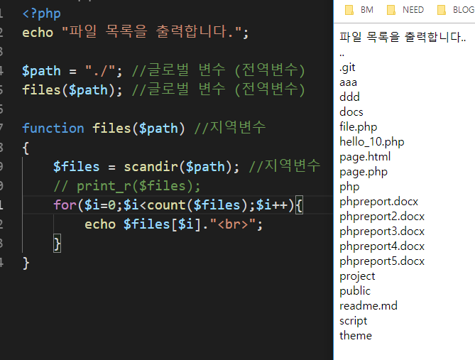
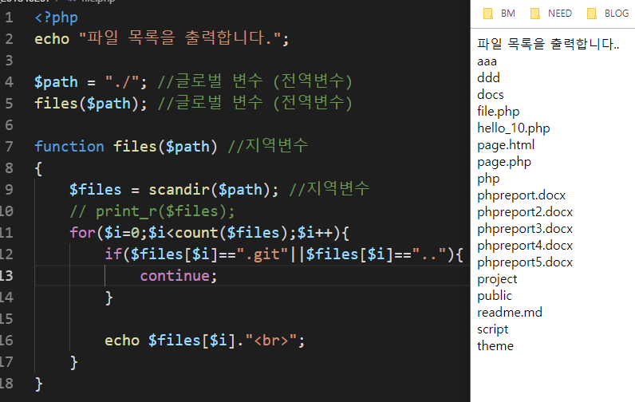
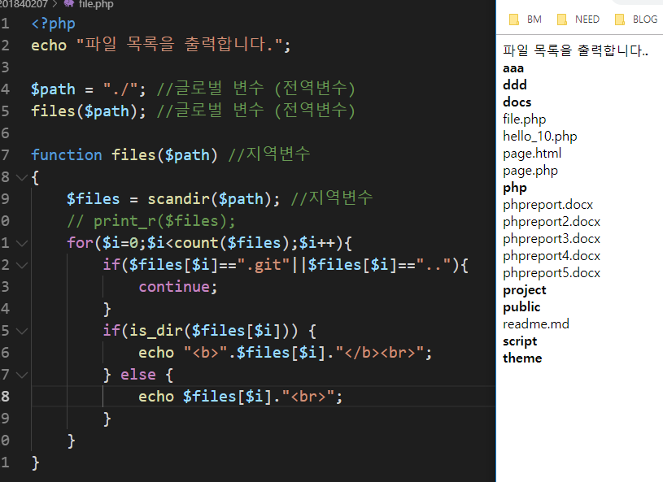
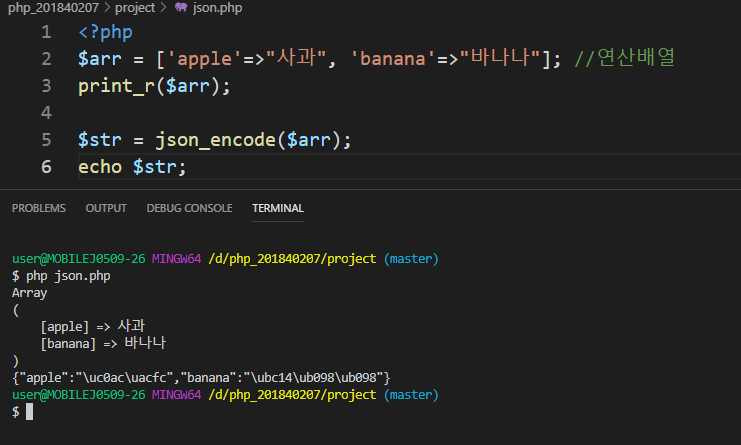

# 2019.10.02
## 수업내용 정리

 
그냥 login.php를 실행하면 ‘로그인 합니다.’ 가 뜨고  
Loginup.php를 브라우저에서 실행을 하고 login.php를 실행하면 ‘대숙이 로그인 합니다.’ 라고 뜬다.  
Session을 사용하면 서버에 저장 / 쿠키는 사용자 컴퓨터 브라우저에 저장 
 
세션과 쿠키를 이용해서 값을 저장한 후 화면에 출력 
 
 
파일 목록 출력 콘솔창에서 출력한 것과 브라우저에서 출력한 것 
 
 
코드는 다르지만 같은 결과 
 
.git과 ..은 빼고 출력 
 
디렉토리면 굵게 디렉토리가 아닌 일반 파일이면 그냥 출력 
 