# 2019.10.23
## 수업내용 정리

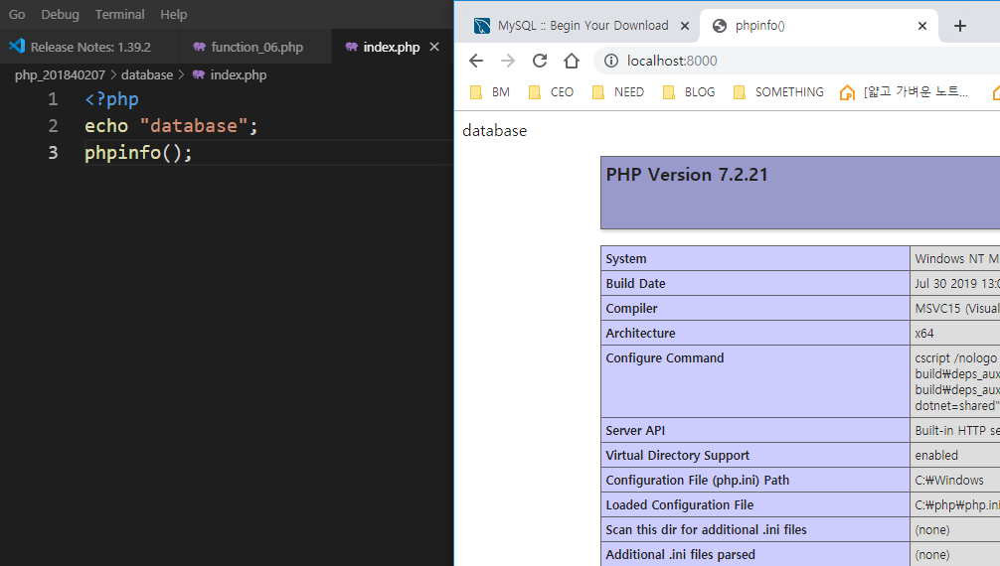
Phpinfo() => php정보 보여줌
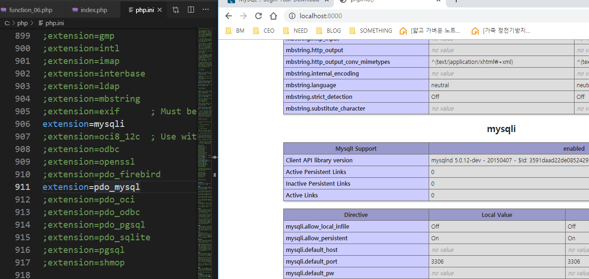
php.ini 파일 열어서 906, 911번째 줄 ;지워서 사용해줌
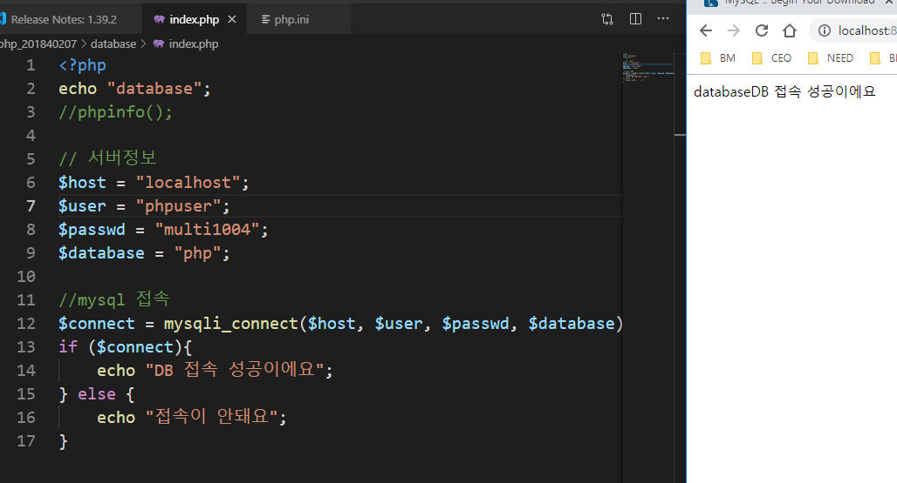
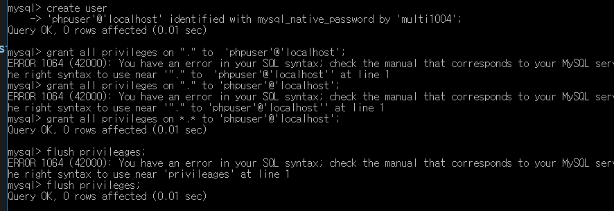
Cmd 창에 저렇게 입력하면 mysql에 접속된다.
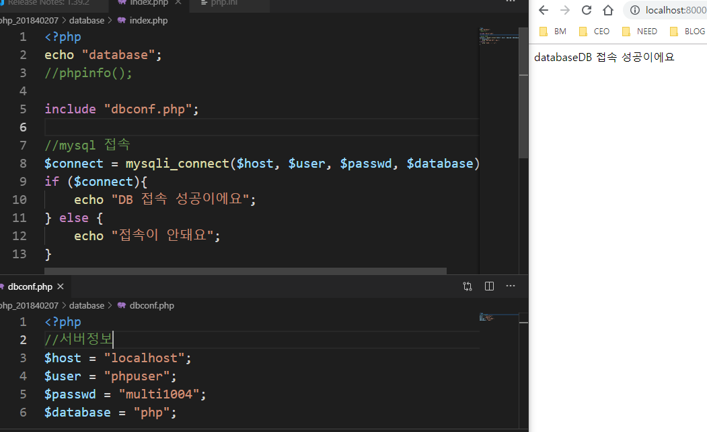
다른 파일에 서버정보를 넣어주고 include로 합침
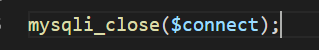 mysql 연결 끊어줌 
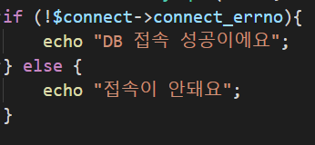 에러가 있으면 접속안돼요 없으면 접속성공  
성공 -> connect_errno = 0, 실패 -> connect_errno = 1
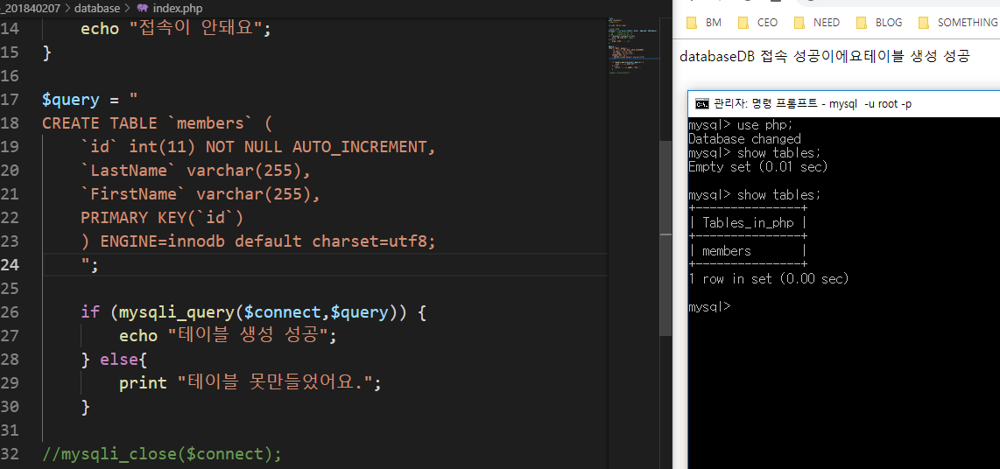
php파일 안에 table을 만들어서 서버로 실행한 후 테이블 생성
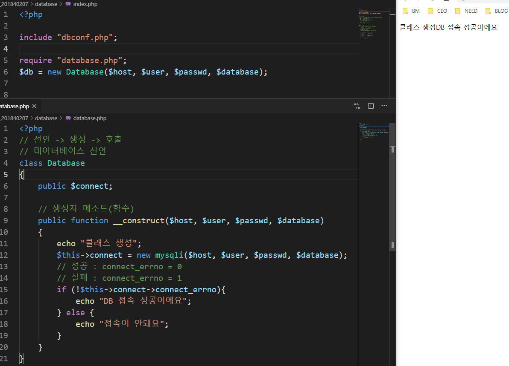
클래스를 만들어서 database 접속
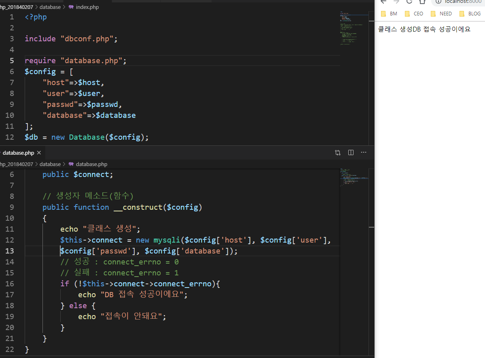 연상배열 사용
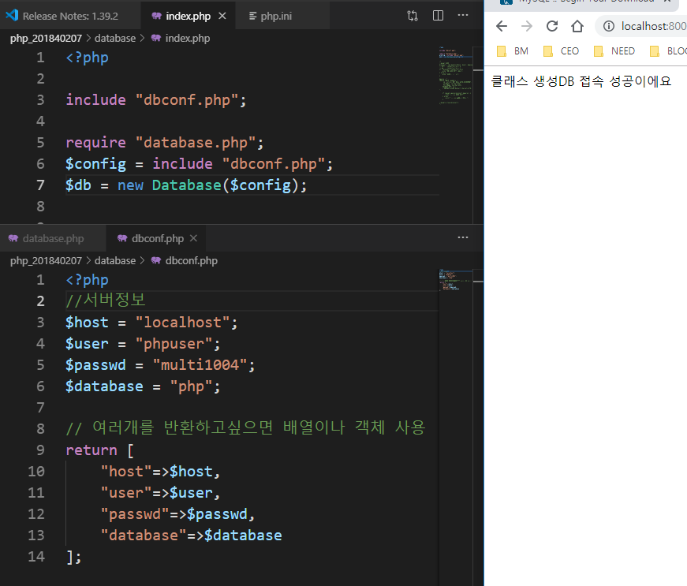
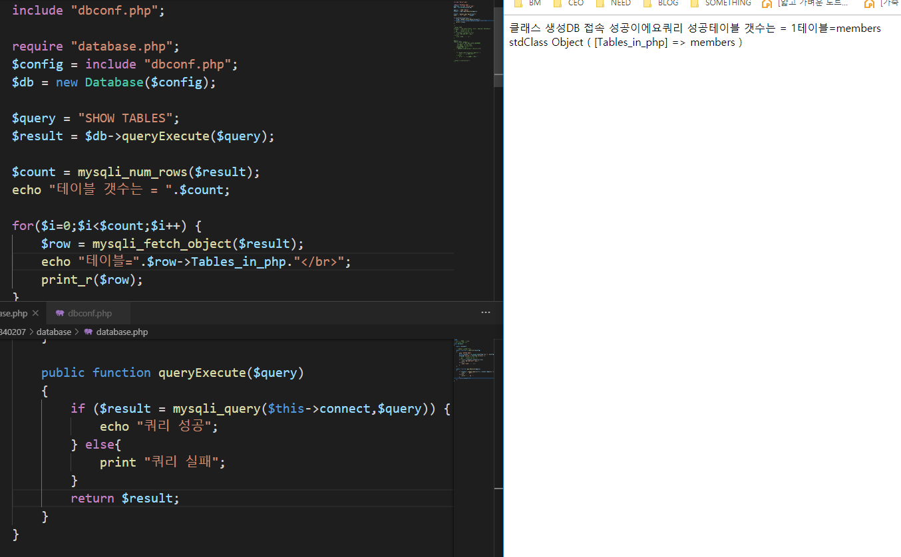 
테이블 목록 뽑아냄
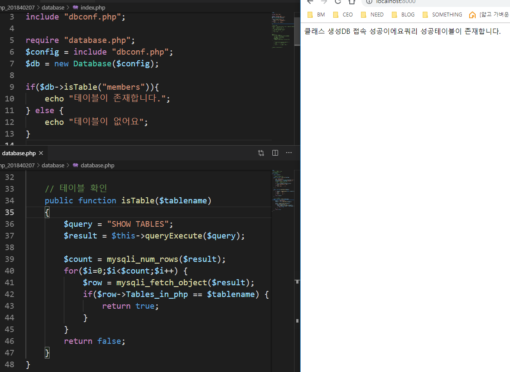
members라는 테이블이 있으면 테이블이 존재합니다. 라고 나옴
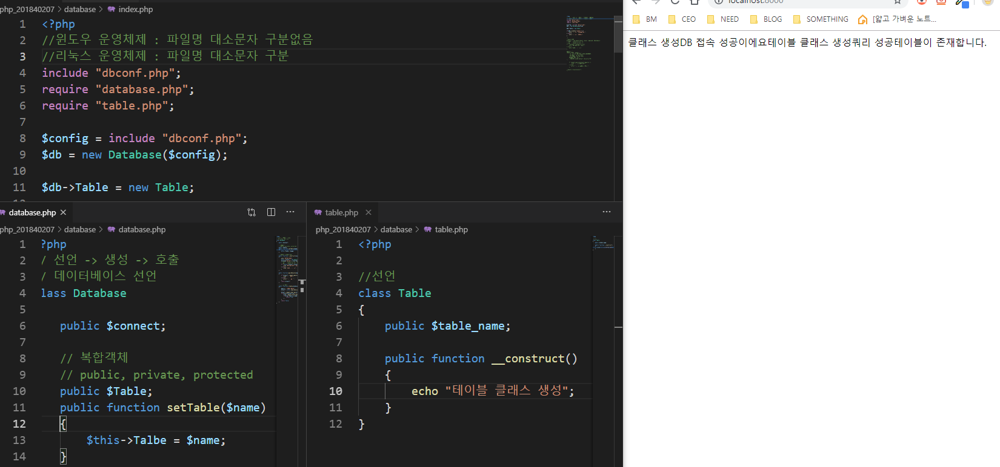
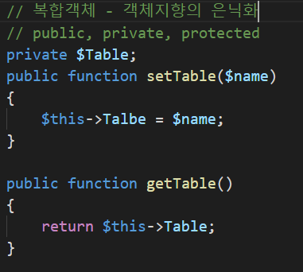 
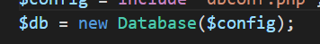 
객체지향의 은닉화
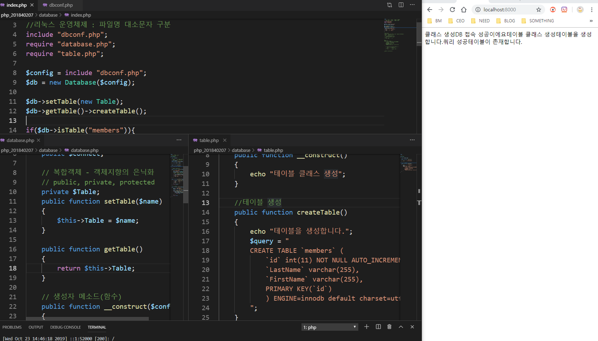 
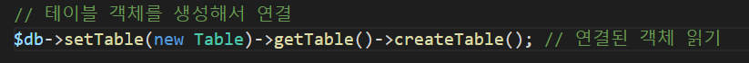 
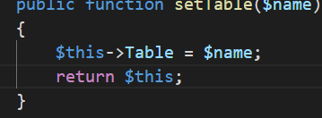 메소드체인 사용
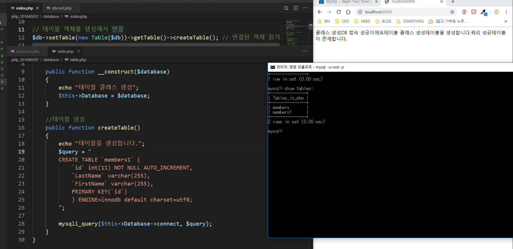
의존성 (여러 객체들이 연결되어 하나의 기능을 함) 
메소드 체인을 사용해서 members1 테이블 생성
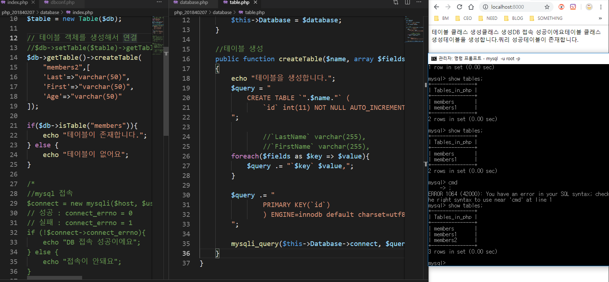
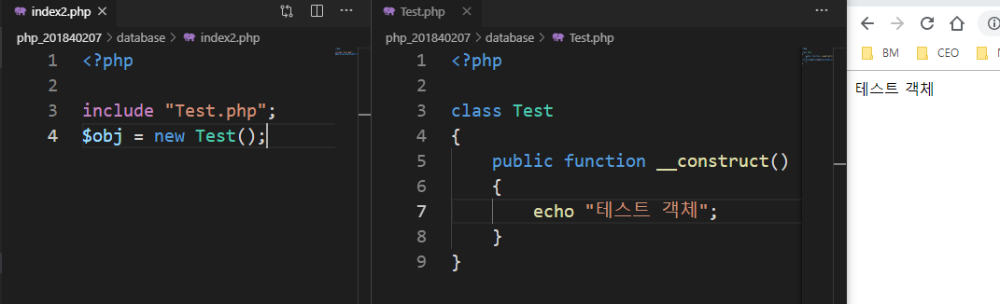 
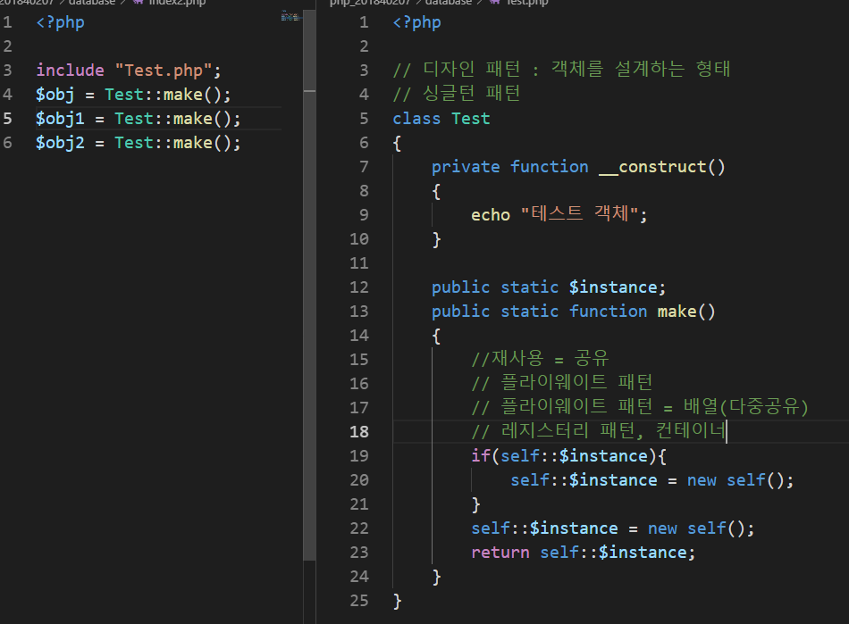
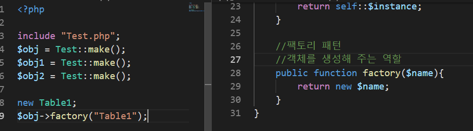 
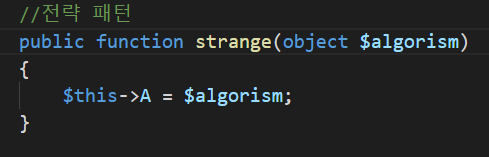
