# 2019.11.06
## 수업내용 정리

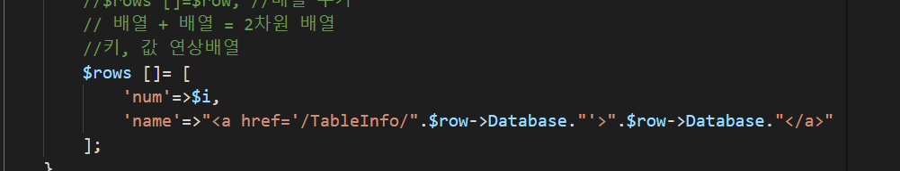

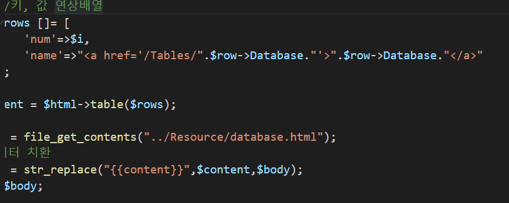
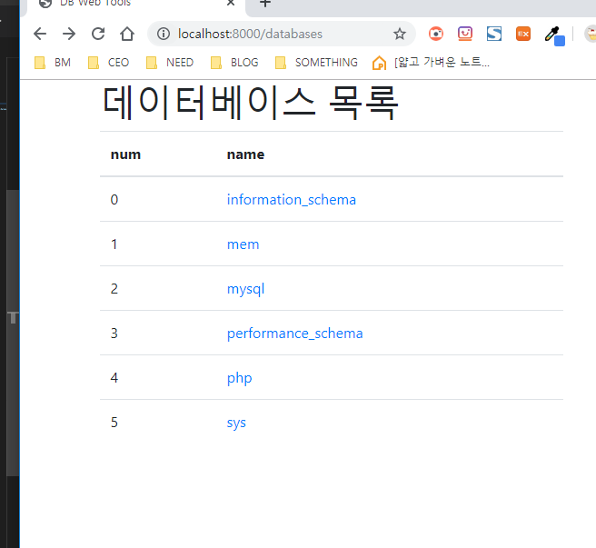
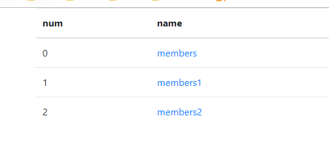
Php 클릭하면 table 구성이 나옴
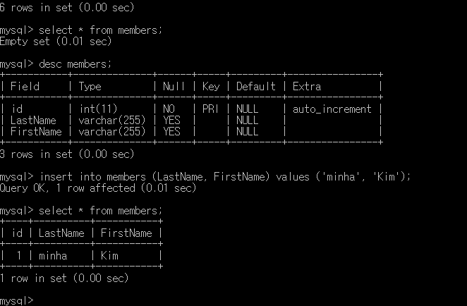
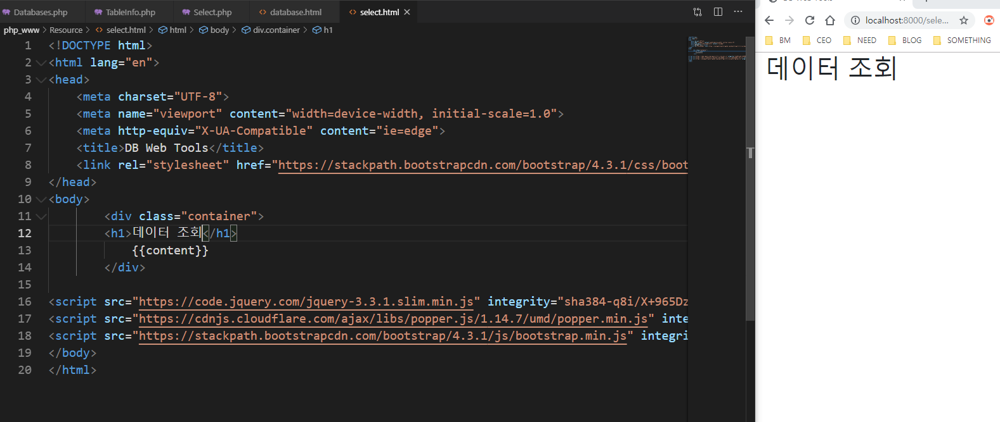
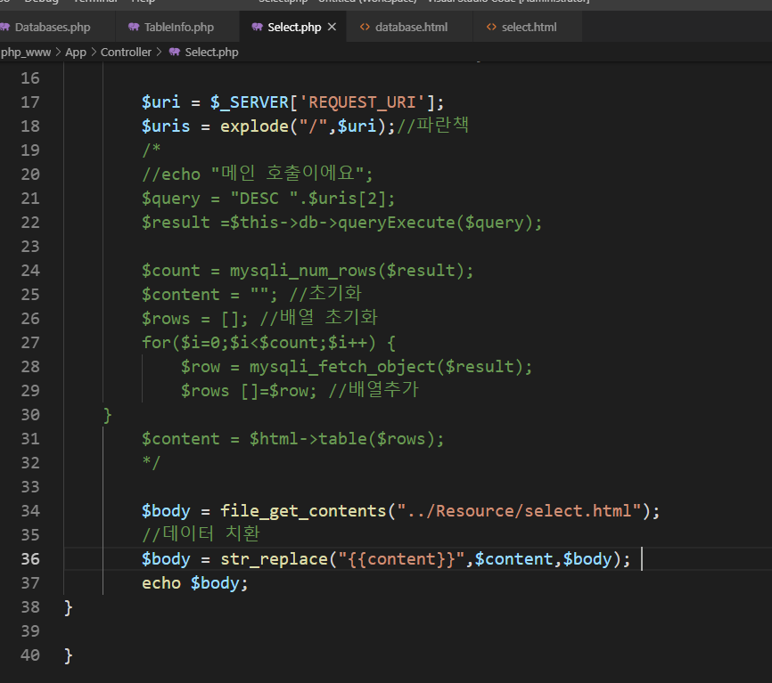
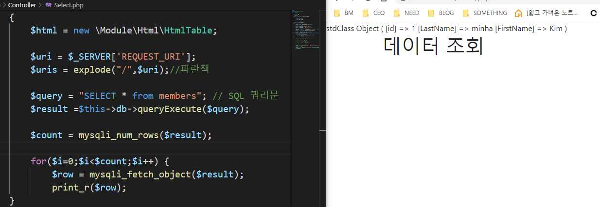
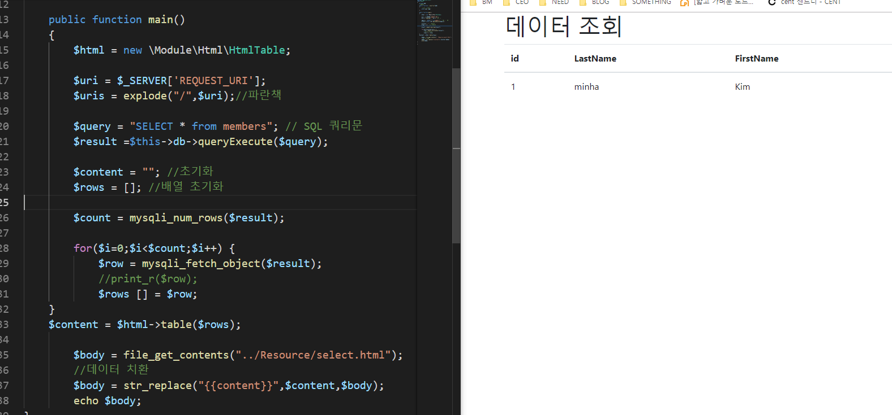

테이블안에 데이터가 있으면 나오고 없으면 데이터없음이라고 출력
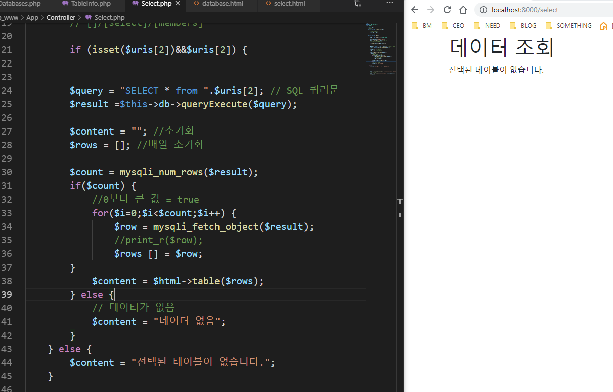
주소창에 테이블명을 쓰지않으면 위의 화면처럼 출력
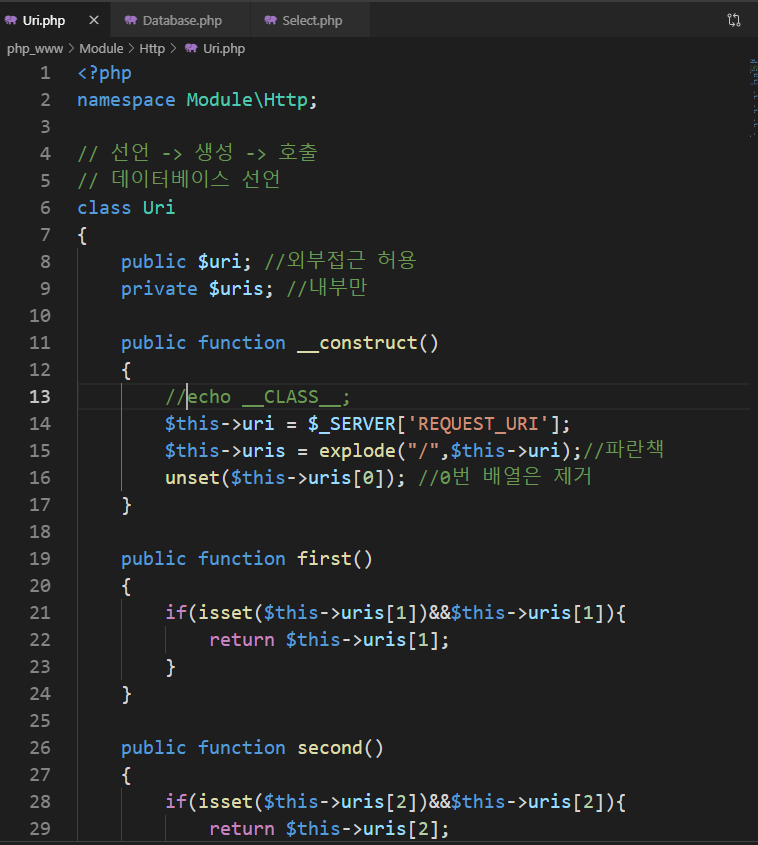
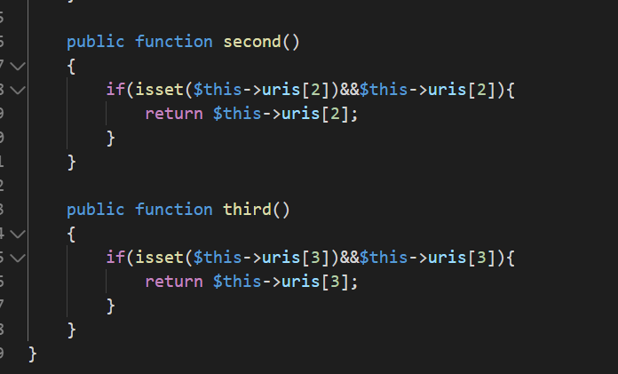
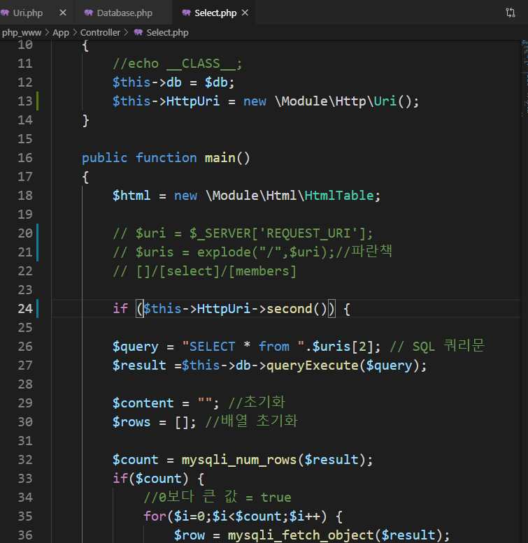
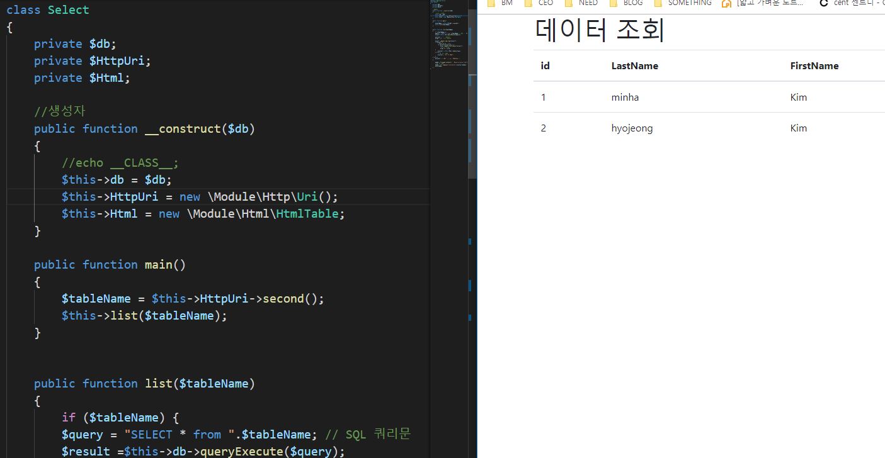

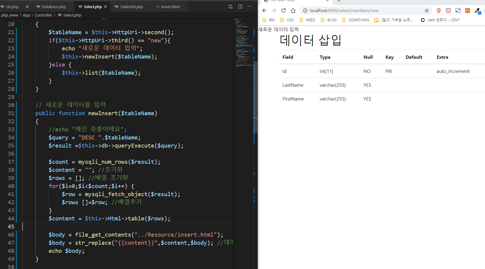
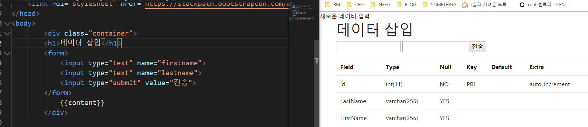
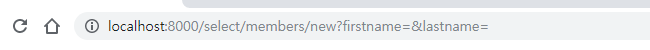
버튼을 누르면 url이 바뀜
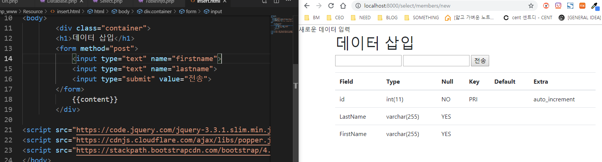
Form의 method를 post로 하면 전송을 눌러도 바뀌지않음
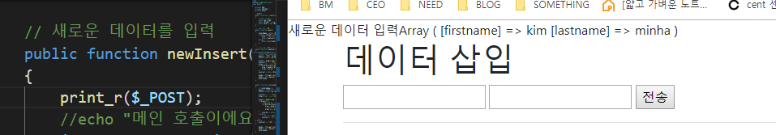
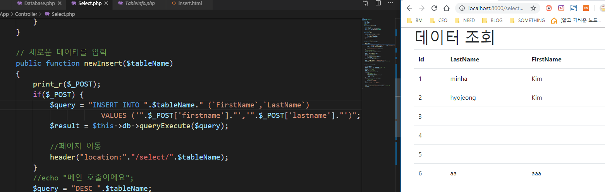
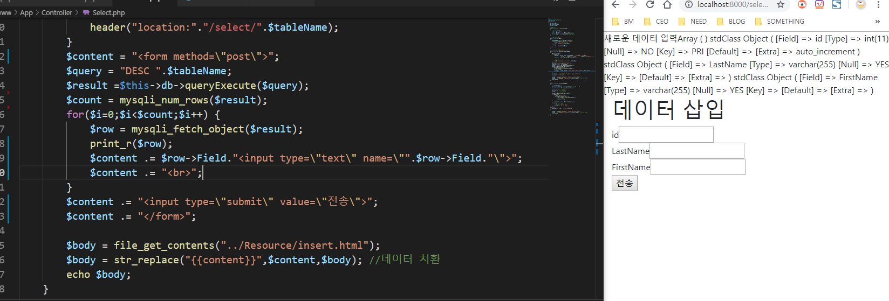
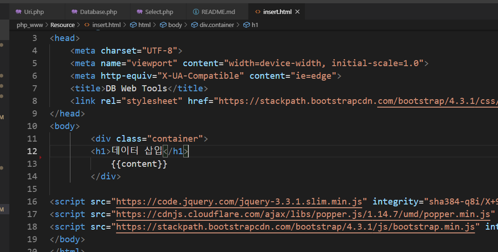
리소스파일에서 input 삭제하고 php에 작성
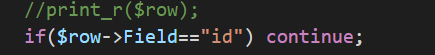 id는 안뜸
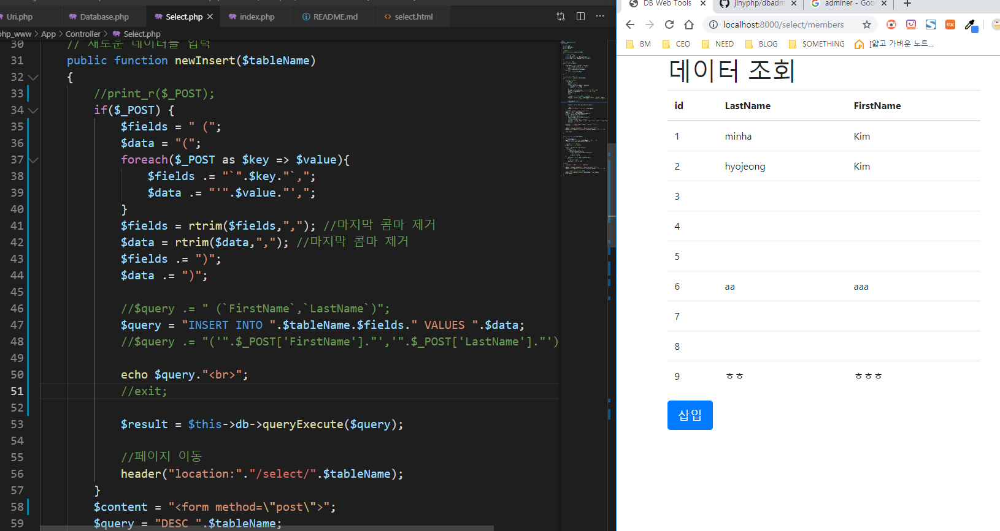
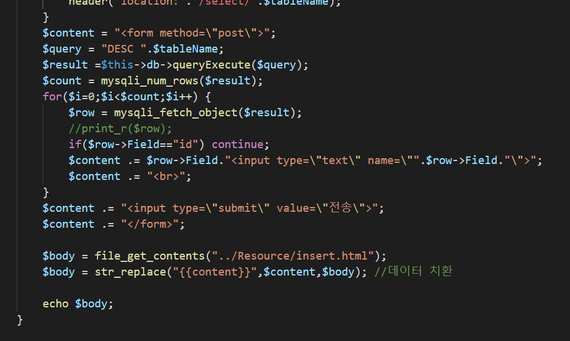
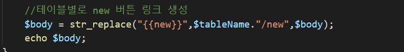
list함수에추가
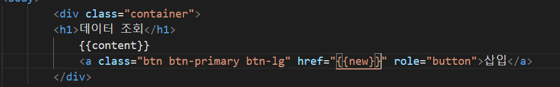
Select.html에 추가