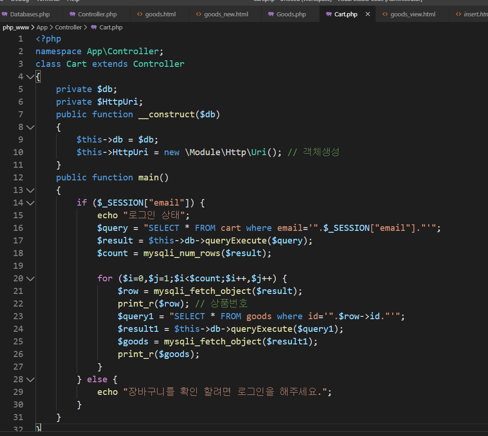

# 2019.11.27
## 수업내용 정리

 
 
인터페이스 
 
 
추상클래스 
 
 
 
 
Select.html 복사해서 goods.html 만듦 
 
 
 
 
 
 
 
 
 
 
 
삽입누르면 뜨는 화면 
 
데이터 들어감 
 
 
 
Images/를 안 쓰면 public 폴더 안에 image1.png가 들어감 
 
 
 
바탕화면에 있던 image4,png가 images폴더 안으로 들어감 
 
 
Goods.phpv 
 
 
Goods_view.html 
 
클릭한 횟수가 뜨고 클릭을 많이 한 게시물이 위로 올라감 