# 2019.11.27
## 수업내용 정리

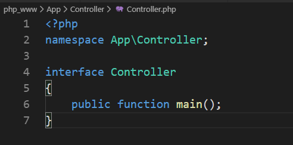

인터페이스
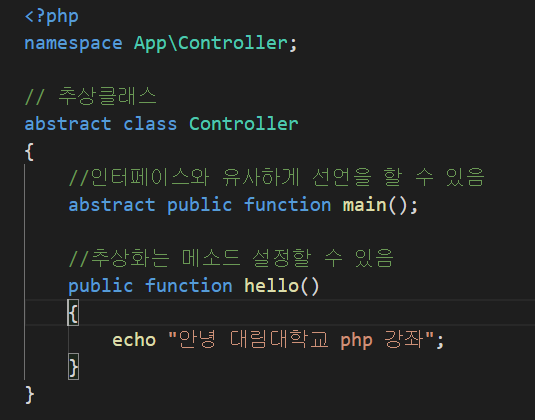

추상클래스

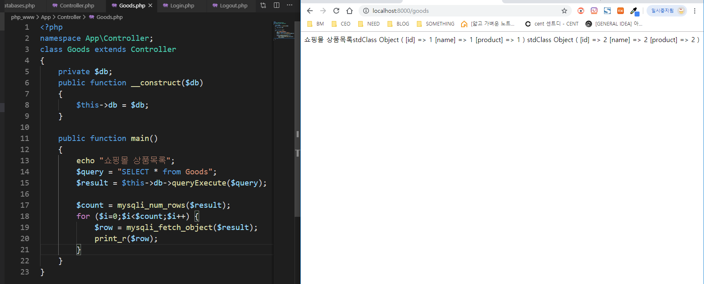
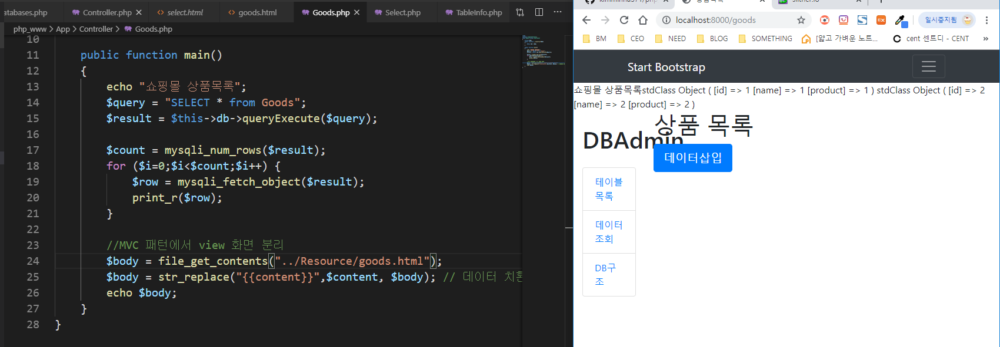
Select.html 복사해서 goods.html 만듦
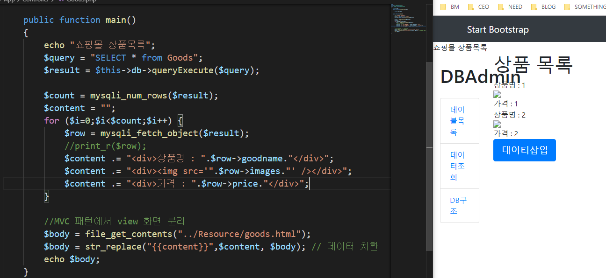

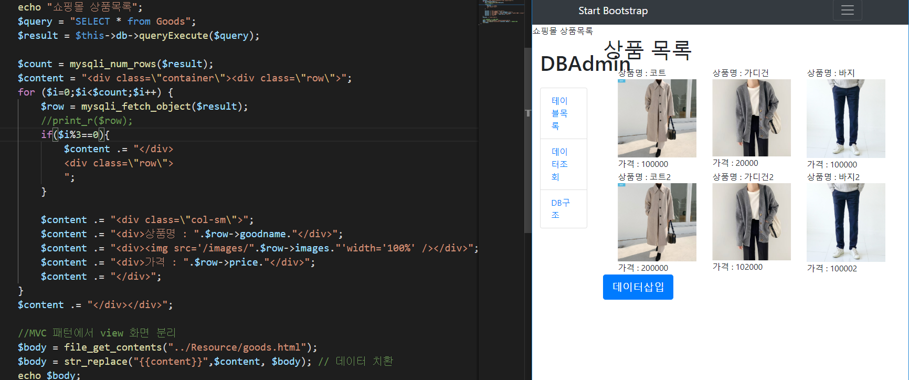
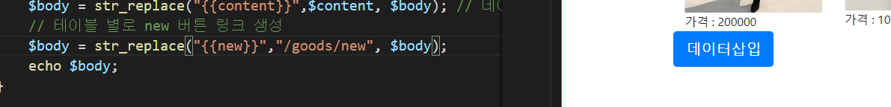
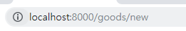
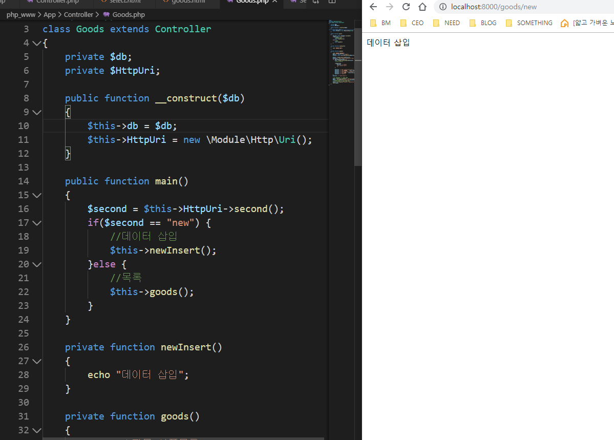
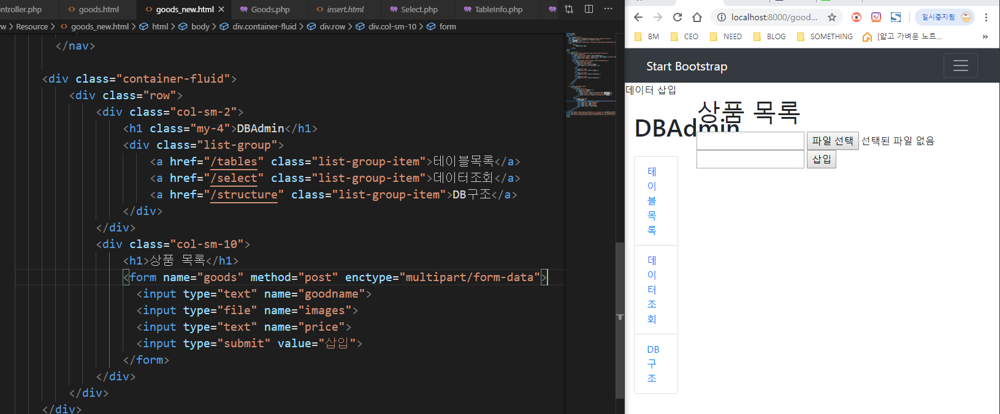

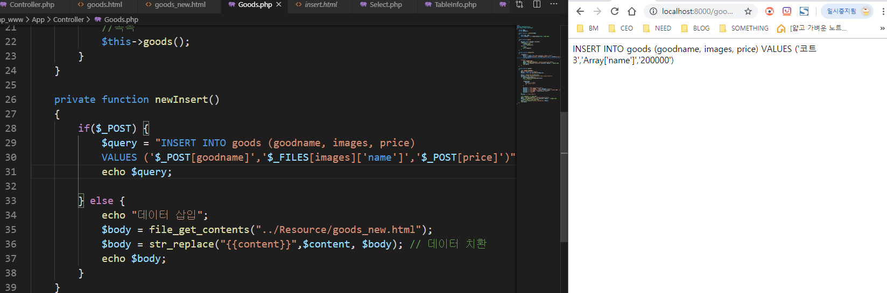
삽입누르면 뜨는 화면

데이터 들어감
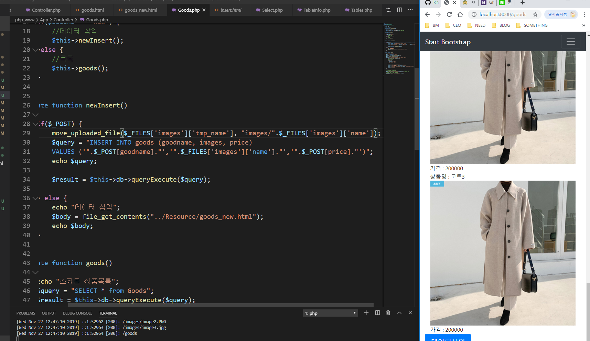

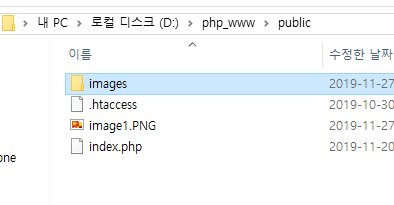
Images/를 안 쓰면 public 폴더 안에 image1.png가 들어감

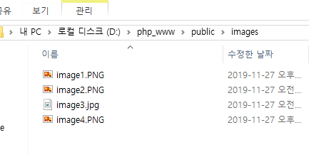
바탕화면에 있던 image4,png가 images폴더 안으로 들어감

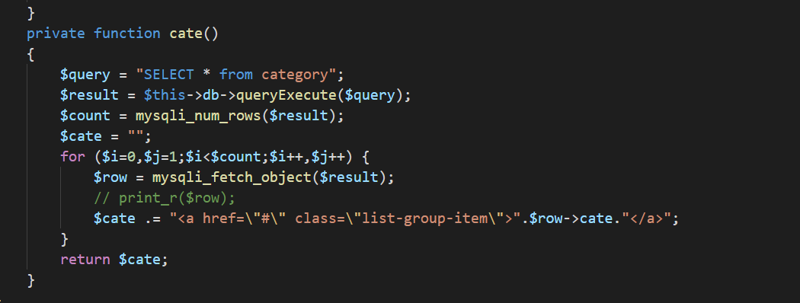
Goods.php

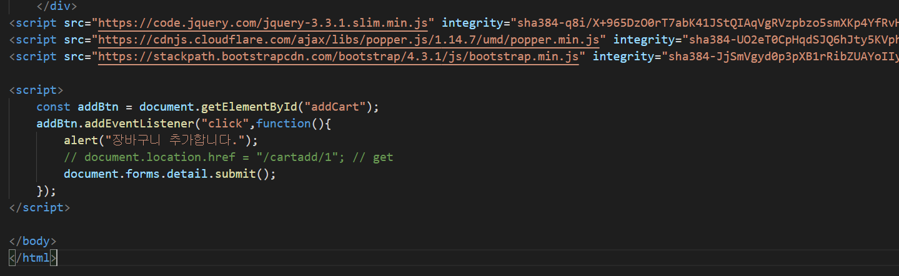
Goods_view.html
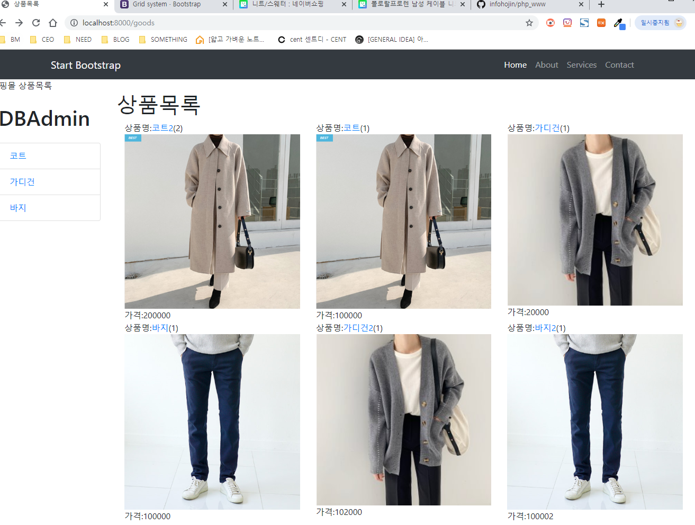
클릭한 횟수가 뜨고 클릭을 많이 한 게시물이 위로 올라감